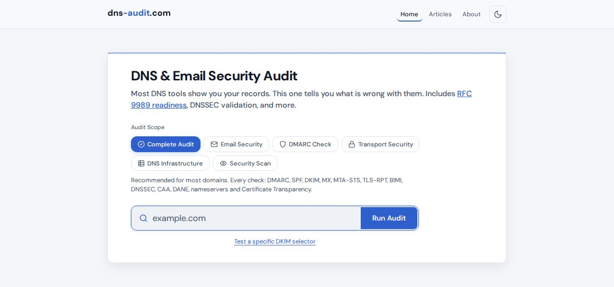
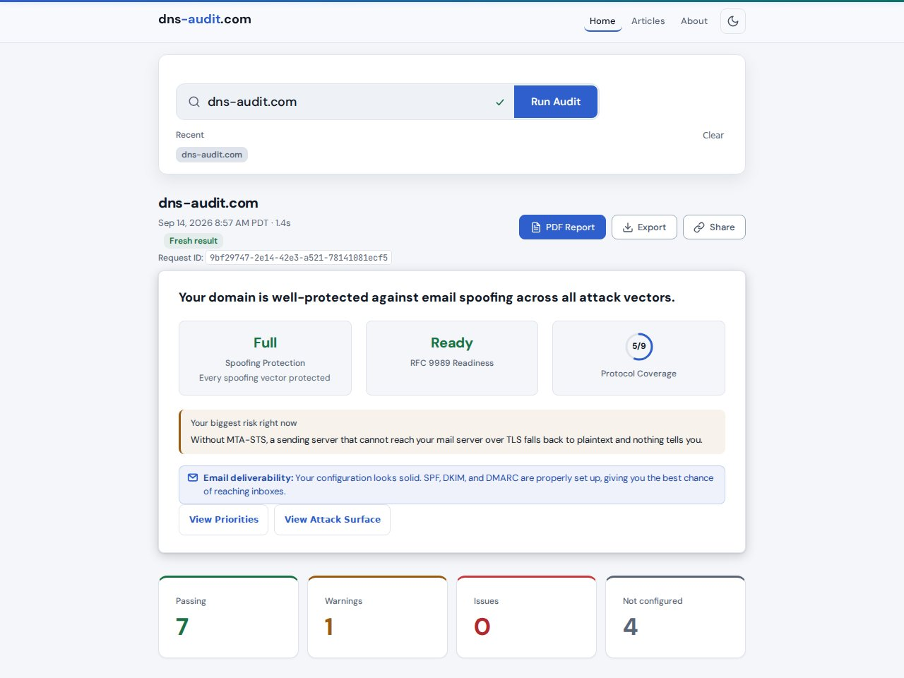

# dns-audit.com

**DNS and email security audit, with DMARC checked against RFC 9989**

dns-audit.com audits a domain's DNS and email security: enter a domain and get plain-language findings and copy-paste DNS records that fix them. DMARC is checked against RFC 9989, the current standard, and against the RFC 7489 behavior most receivers still implement; [the RFC 9989 article](https://dns-audit.com/articles/dmarcbis) explains what changed. Live at [dns-audit.com](https://dns-audit.com).





## 12 Security Checks

### Authentication

| Check | What It Does |
|-------|-------------|
| **DMARC + RFC 9989** | Validation against RFC 9989 and against RFC 7489, side by side, with a per-tag decoder, dangerous-combination detection, and the DNS Tree Walk of [RFC 9989 Section 4.10](https://www.rfc-editor.org/rfc/rfc9989.html#section-4.10) for hierarchical policy discovery. |
| **SPF** | Syntax validation, mechanism analysis, recursive evaluation with full lookup chain tracing, void lookup detection, and vendor-labeled include tree visualization. Flags `+all`, `?all`, missing `all`, `redirect`+`all` conflicts, deprecated `ptr`, overly broad CIDRs, and invalid IPs. |
| **DKIM** | Selector discovery from a list of about 1,100 known selectors, narrowed by SPF-based vendor fingerprinting to about 200 lookups per audit. Key strength analysis for RSA (1024/2048/4096) and Ed25519. Direct lookup of user-supplied selectors. Wildcard DNS detection prevents false positives. |

### Mail and Transport

| Check | What It Does |
|-------|-------------|
| **MX Records** | Mail exchanger discovery, vendor fingerprinting, FCrDNS validation, redundancy analysis, dangling MX detection, null MX (RFC 7505) recognition. Major providers recognized as internally redundant. |
| **MTA-STS** | `TXT` record validation, HTTPS policy file retrieval and parsing, mode analysis (`enforce`/`testing`/`none`), MX pattern cross-referencing, `max_age` evaluation. |
| **TLS-RPT** | SMTP TLS reporting record validation, report destination verification (`mailto` and HTTPS). |
| **BIMI** | Record parsing, DMARC enforcement prerequisite check (including inherited policies), SVG logo fetch with Tiny PS profile validation, script element detection, external reference scanning, `viewBox` verification, file size check, VMC certificate tag analysis. |

### DNS and Cryptographic Controls

| Check | What It Does |
|-------|-------------|
| **DNSSEC** | `DNSKEY` presence, `DS` record validation at parent zone (recursive + direct parent NS query), algorithm analysis against the IANA DNSSEC algorithm registries, which RFC 9904 made the canonical source in place of RFC 8624, chain of trust verification via `AD` flag and `DS`-to-`DNSKEY` digest matching. |
| **CAA** | Certificate Authority Authorization records, issuer restrictions (`issue`), wildcard policy (`issuewild`), incident reporting (`iodef`). |
| **DANE** | `TLSA` record lookup for each MX host, usage/selector/matching type analysis, DNSSEC dependency enforcement per RFC 7672. |

### Infrastructure and Certificates

| Check | What It Does |
|-------|-------------|
| **Nameservers** | NS count, resolution and authoritative response verification, `SOA` serial consistency, IPv6 support, network diversity across /24 ranges, provider identification. |
| **Certificate Transparency** | CT log query via crt.sh, issuer breakdown, CAA mismatch detection, expiring certificate alerts, subdomain discovery. |

## How Results Are Presented

There are no letter grades and no numeric score. Results open with three summary metrics:

| Metric | What It Shows |
|--------|---------------|
| Spoofing Protection | Whether direct, subdomain, and non-existent-subdomain spoofing are closed by the DMARC policy, naming any that are not. |
| RFC 9989 Readiness | Ready, Compatible, In progress, or Action needed |
| Protocol Coverage | How many of up to nine protocols (DMARC, SPF, DKIM, MTA-STS, TLS-RPT, DANE, DNSSEC, BIMI, CAA) are configured |

Below the summary, each check reports pass, warning, fail, not configured, or not checked, with the finding and a copy-paste fix where one applies. A prioritized roadmap orders the fixes by impact.

DNS cannot list DKIM selectors, so name yours for the best result; an undetected selector is never marked down.

## Features

- **RFC 9989 tree walk**: Section 4.10 policy discovery, capped at eight queries, beside the RFC 7489 lookup, with a strict record validator (38 finding codes).
- **SPF trace**: every `include` and `redirect` with its lookup cost, vendors labeled.
- **Defensive DNS**: null MX, `v=spf1 -all` and `p=reject` read as a non-mail domain, not as missing records.
- **Resilience**: whether mail still passes DMARC when SPF or DKIM fails alone.
- **Anomalies**: cross-check findings, such as MTA-STS without TLS-RPT.
- **PDF report**: executive summary, priorities, detected vendors, and every check card.
- **Scoped audits**: six scopes, each running only the checks it needs.
- **Vendor detection**: from MX hosts, SPF includes, DMARC `rua` addresses, and DKIM selectors.
- **Roadmap**: one prioritized fix list across all protocols, in four tiers.

## Architecture

Single-page app on FastAPI, dnspython and reportlab, with vanilla JavaScript. No accounts, no tracking. The only database is a SQLite table of DNS records seen in past audits, used for change detection and pruned after 90 days.

```
server.py                  FastAPI app, SSE, rate limiting, caching
config.py                  Settings from the environment
audit_engine.py            Check orchestration and timeouts
result_transformer.py      Raw results to cards, metrics, roadmap
pdf_report.py              PDF report
dns_tools.py               Domain normalization, resolvers
dns_snapshots.py           DNS record history for change detection
dmarc_tree_walk.py         RFC 9989 tree walk
spf_recursive.py           SPF lookup counter
spf_execution_engine.py    SPF trace, DMARC evaluation summary
spf_intelligence.py        DKIM selector discovery from SPF vendors
checks_extra.py            MTA-STS, TLS-RPT, BIMI
mx_check.py                MX analysis
dkim_formatter.py          DKIM key analysis
comprehensive_selectors.py Known DKIM selectors
advanced_fingerprinting.py Vendor fingerprinting
anomaly_detector.py        Cross-check anomalies
ua_classify.py             Browser and bot labels for the audit log

static/
  index.html               App shell
  app.js                   Result rendering
  style.css                Styles and design tokens
  theme.js                 Theme toggle
  articles.js              Articles filter
  articles/                Articles

tools/                     Operator scripts
  live_check.py            Card statuses from a deployed site
  rewrite_audit_log_ua.py  Old audit log entries to the log policy

deploy/
  dns-auditor.service      systemd unit template
```

Review history: [docs/history](docs/history/README.md).

## API

```
GET /api/audit?domain=example.com              JSON response
GET /api/audit/stream?domain=example.com       SSE streaming
GET /api/audit/{domain}/pdf                    PDF download
GET /api/health                                Health check (DNS resolution, running commit)
```

Optional parameters: `selector`, `scope`. Rate limited to 10 requests per IP per minute. Results cached for 5 minutes.

## Self-Hosting

Python 3.10 or newer: seven pinned dependencies require it. CI runs tests on 3.11 and security scans on 3.12; production runs 3.12.

```bash
pip install -r requirements.txt
uvicorn server:app --host 127.0.0.1 --port 8000
```

Run it behind a reverse proxy that terminates TLS, bound to loopback. Exposed on 0.0.0.0, set `TRUSTED_PROXY_IPS=` (empty), or any client can rotate `X-Real-IP` past the rate limit. Never pass `--proxy-headers`. Run one worker: the cache, rate limiter and concurrency budget are per process. `/api/health` reports the running commit SHA; `BUILD_SHA` overrides it.

## Tests

```bash
pip install -r requirements.txt -r requirements-dev.txt
python3 -m pytest tests/ -q
```

1,086 tests, run against fake DNS zones. The `no_network` fixture fails any TCP connection off the machine; UDP DNS still gets past it. Browser tests need Playwright (requirements-dev.txt) and `python -m playwright install chromium`, and skip without them.

## What it does not do

- No blocklist lookups.
- No mail sending and no SMTP connections. Outbound traffic is DNS plus HTTPS fetches of MTA-STS policies, BIMI logos, and crt.sh.
- No accounts.
- No stored audit history beyond the 90-day DNS snapshot table. Results are cached in memory for five minutes; the request log keeps each audit's domain and scope, not results.

## License

MIT. See [LICENSE](LICENSE).

## Author

**[Neil Anuskiewicz](https://www.linkedin.com/in/neilanuskiewicz/)**
DNS, email security, and deliverability specialist.

[LinkedIn](https://www.linkedin.com/in/neilanuskiewicz/) | [GitHub](https://github.com/marmot7775) | [dns-audit.com](https://dns-audit.com)
