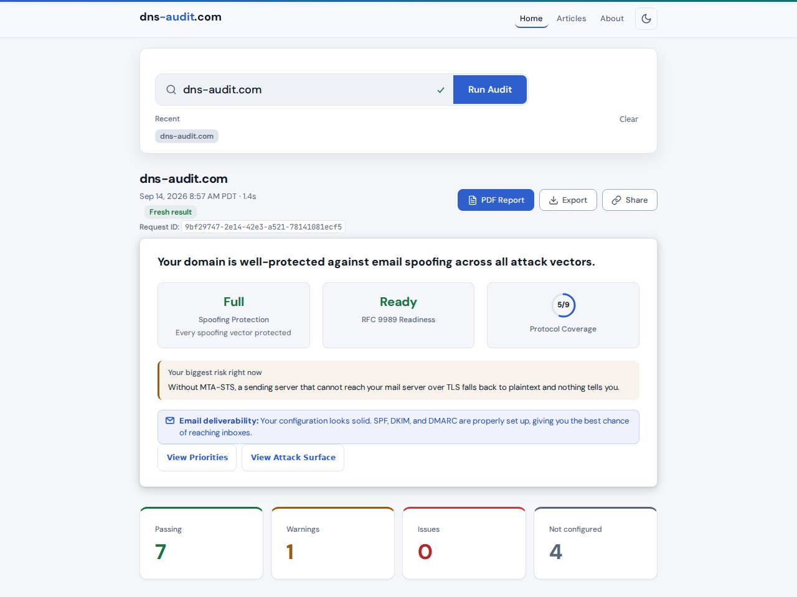

# dns-audit.com

[](https://github.com/marmot7775/dns-audit/actions/workflows/tests.yml)
[](https://github.com/marmot7775/dns-audit/actions/workflows/lint.yml)

**DNS and email security audit, with DMARC checked against RFC 9989**

dns-audit.com audits a domain's DNS and email security: enter a domain and get plain-language findings and copy-paste DNS records that fix them. DMARC is checked against RFC 9989, the current standard, and against the RFC 7489 behavior most receivers still implement; [the RFC 9989 article](https://dns-audit.com/articles/dmarcbis) explains what changed. Live at [dns-audit.com](https://dns-audit.com).

## A real result

dns-audit.com audited on 9 October 2026, in 2.3 seconds. The headline reads "Your domain is protected against spoofing." Spoofing protection: Full. RFC 9989 readiness: Ready. Protocol coverage: 7 of 9. Four of its twelve cards, each with the record it judged:

| Check | Status | Evidence |
|-------|--------|----------|
| DMARC | Pass | `v=DMARC1; p=reject; rua=mailto:hgx4xes7dg@rua.powerdmarc.com,mailto:dmarc_agg@vali.email; ruf=mailto:hgx4xes7dg@ruf.powerdmarc.com;` p=reject, and both report destinations are authorized. |
| SPF | Pass | `v=spf1 include:spf.protection.outlook.com ~all` 1 DNS lookup of the 10 allowed. |
| MTA-STS | Could be stronger | `v=STSv1; id=20260923T184700;` with a policy in testing mode: senders attempt TLS but will not refuse delivery if it fails. |
| Certificate Transparency | Not checked | crt.sh did not answer in time. The card says so, and calls it a gap in the audit, not a finding about the domain. |

The last row is the rule the tool is built on: a lookup that did not complete is reported as not checked, never as a pass or a fail. [ARCHITECTURE.md](ARCHITECTURE.md) lists the others.



## Running an audit

Enter a domain at [dns-audit.com](https://dns-audit.com), or call `GET /api/audit?domain=example.com` for the same result as JSON. Optional parameters: `selector` names your DKIM selector, and `scope` limits the run to email, DMARC, transport, DNS infrastructure or the security scan. Every card shows what it read, its status, what that means, and a copy-paste fix where one applies. The [PDF report](#api) carries the same result.

## What it does not do

- No blocklist lookups.
- No mail sending and no SMTP connections. Outbound traffic is DNS plus HTTPS fetches of MTA-STS policies, BIMI logos, and crt.sh, and error reports to Sentry when SENTRY_DSN is set.
- No accounts.
- No stored audit history beyond the 90-day DNS snapshot table. Results are cached in memory for five minutes; the request log keeps each audit's domain and scope, not results. What gets logged: [the privacy page](https://dns-audit.com/privacy).

## 12 Security Checks

### Authentication

| Check | What It Does |
|-------|-------------|
| **DMARC + RFC 9989** | Validation against RFC 9989 and against RFC 7489, side by side, with a per-tag decoder, dangerous-combination detection, and the DNS Tree Walk of [RFC 9989 Section 4.10](https://www.rfc-editor.org/rfc/rfc9989.html#section-4.10) for hierarchical policy discovery. |
| **SPF** | Syntax validation, mechanism analysis, recursive evaluation with full lookup chain tracing, void lookup detection, and vendor-labeled include tree visualization. Flags `+all`, `?all`, missing `all`, `redirect`+`all` conflicts, deprecated `ptr`, overly broad CIDRs, and invalid IPs. |
| **DKIM** | Selector discovery from a list of about 1,100 known selectors. When SPF or MX names a vendor, up to 40 selectors chosen for it are tried first; otherwise the list's first entries are. 46 email service selectors (Mailchimp, SendGrid, Klaviyo and others) are tried alongside them on every domain. A sweep of up to 156 more common names runs only when those find nothing. Key strength analysis for RSA (1024/2048/4096) and Ed25519. Direct lookup of user-supplied selectors. Wildcard DNS detection prevents false positives. |

### Mail and Transport

| Check | What It Does |
|-------|-------------|
| **MX Records** | Mail exchanger discovery, vendor fingerprinting, redundancy analysis, dangling MX detection, null MX (RFC 7505) recognition. Major providers recognized as internally redundant. |
| **MTA-STS** | `TXT` record validation, HTTPS policy file retrieval and parsing, mode analysis (`enforce`/`testing`/`none`), MX pattern cross-referencing, `max_age` evaluation. |
| **TLS-RPT** | SMTP TLS reporting record validation, including the syntax of each report destination (`mailto` and `https`). |
| **BIMI** | Record parsing, DMARC enforcement prerequisite check (including inherited policies), SVG logo fetch with Tiny PS profile validation, script element detection, external reference scanning, `viewBox` verification, file size check, VMC certificate tag analysis. |

### DNS and Cryptographic Controls

| Check | What It Does |
|-------|-------------|
| **DNSSEC** | `DNSKEY` presence, `DS` record validation at parent zone (recursive + direct parent NS query), algorithm analysis against the IANA DNSSEC algorithm registries, which RFC 9904 made the canonical source in place of RFC 8624, chain of trust verification via `AD` flag and `DS`-to-`DNSKEY` digest matching. |
| **CAA** | Certificate Authority Authorization records, issuer restrictions (`issue`), wildcard policy (`issuewild`), incident reporting (`iodef`). |
| **DANE** | `TLSA` record lookup for each MX host, usage/selector/matching type analysis, DNSSEC dependency enforcement per RFC 7672. |

### Infrastructure and Certificates

| Check | What It Does |
|-------|-------------|
| **Nameservers** | NS count, resolution and authoritative response verification, `SOA` serial consistency, IPv6 support, network diversity across /24 ranges, provider identification. |
| **Certificate Transparency** | CT log query via crt.sh, issuer breakdown, CAA mismatch detection, expiring certificate alerts, subdomain discovery. |

## How Results Are Presented

There are no letter grades and no numeric score. Results open with three summary metrics:

| Metric | What It Shows |
|--------|---------------|
| Spoofing Protection | Whether direct, subdomain, and non-existent-subdomain spoofing are closed by the DMARC policy, naming any that are not. |
| RFC 9989 Readiness | Ready, Compatible, In progress, Action needed, or Not assessed. Ready also requires an enforcing policy (p=quarantine or p=reject) and an rua address, which RFC 9989 itself does not require. |
| Protocol Coverage | How many of up to nine protocols (DMARC, SPF, DKIM, MTA-STS, TLS-RPT, DANE, DNSSEC, BIMI, CAA) are configured |

Below the summary, each check reports pass, warning, fail, not configured, or not checked, with the finding and a copy-paste fix where one applies. A prioritized roadmap orders the fixes by impact.

DNS cannot list DKIM selectors, so name yours for the best result; an undetected selector is never marked down.

## Features

- **RFC 9989 tree walk**: Section 4.10 policy discovery, capped at eight queries, beside the RFC 7489 lookup, with a strict record validator (38 finding codes).
- **SPF trace**: every `include` and `redirect` with its lookup cost, vendors labeled.
- **Defensive DNS**: null MX, `v=spf1 -all` and `p=reject` read as a non-mail domain, not as missing records.
- **Resilience**: whether mail still passes DMARC when SPF or DKIM fails alone.
- **Anomalies**: cross-check findings, such as MTA-STS without TLS-RPT.
- **PDF report**: executive summary, priorities, detected vendors, and every check card.
- **Scoped audits**: six scopes, each running only the checks it needs.
- **Vendor detection**: from MX hosts, SPF includes, and DMARC and TLS-RPT `rua` addresses.
- **Roadmap**: one prioritized fix list across all protocols, in four tiers.

## Architecture

Single-page app on FastAPI, dnspython and reportlab, with vanilla JavaScript. No accounts, no tracking. The only database is a SQLite table of DNS records seen in past audits, used for change detection and pruned after 90 days.

The pipeline from request to report, which module owns what, and the rules the code keeps: [ARCHITECTURE.md](ARCHITECTURE.md). Why it is built this way: [docs/decisions](docs/decisions/). Review history: [docs/history](docs/history/README.md).

## API

```
GET /api/audit?domain=example.com              JSON response
GET /api/audit/stream?domain=example.com       SSE streaming
GET /api/audit/{domain}/pdf                    PDF download
GET /api/health                                Health check (DNS resolution, running commit)
```

Optional parameters: `selector`, `scope`. Rate limited to 10 requests per IP per minute. Results cached for 5 minutes.

## Self-Hosting

The Python floor and the dependencies are declared once, in [pyproject.toml](pyproject.toml). The requirements files are generated from it.

```bash
pip install -r requirements.txt
uvicorn server:app --host 127.0.0.1 --port 8000
```

Run it behind a reverse proxy that terminates TLS, bound to loopback. Exposed on 0.0.0.0, set `TRUSTED_PROXY_IPS=` (empty), or any client can rotate `X-Real-IP` past the rate limit. Keep uvicorn's proxy headers trusting loopback only (`--forwarded-allow-ips 127.0.0.1`, the default). Run one worker: the cache, rate limiter and concurrency budget are per process. `/api/health` reports the running commit SHA; `BUILD_SHA` overrides it.

## Tests

```bash
pip install -r requirements.txt -r requirements-dev.txt
python3 -m pytest tests/ -q
```

More than 2,500 tests, run against fake DNS zones. The `no_network` fixture fails any TCP connection off the machine; UDP DNS still gets past it. Browser tests need Playwright (requirements-dev.txt) and `python -m playwright install chromium`, and skip without them.

To change something: [CONTRIBUTING.md](CONTRIBUTING.md).

## License

MIT. See [LICENSE](LICENSE).

## Author

**[Neil Anuskiewicz](https://www.linkedin.com/in/neilanuskiewicz/)**
DNS, email security, and deliverability specialist.

[LinkedIn](https://www.linkedin.com/in/neilanuskiewicz/) | [GitHub](https://github.com/marmot7775) | [dns-audit.com](https://dns-audit.com)
